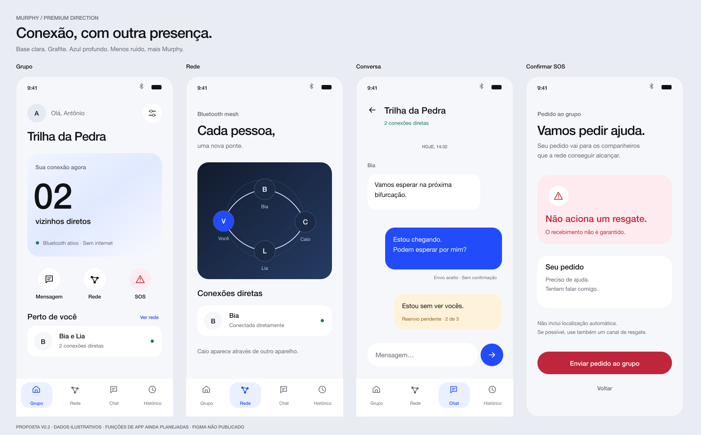

# Murphy

Murphy is a peer-to-peer BLE mesh network for outdoor activities such as hiking and surfing. It is designed for communication when there is no internet or cellular coverage, with shared networking logic across Android and iOS through Kotlin Multiplatform.

The project is intentionally starting with the shared domain core before platform-specific Bluetooth integrations. The first increment establishes:

- a connection state machine;
- a small, testable mesh packet router with TTL and duplicate protection;
- a deterministic topology simulator for relay failures and rerouting;
- an offline event history with a replaceable store;
- routing decision events that make forwarding, delivery and drops visible to the UI;
- a shared transport coordinator that bridges BLE connections and routing decisions;
- per-peer send outcomes, so a failed link does not stop attempts on other links.

## Project direction

- Kotlin Multiplatform shared module;
- native Bluetooth adapters per platform;
- offline-first operation;
- no dependency on a central server for peer-to-peer messaging;
- explicit state and event history for debugging and emergency scenarios;
- a storage seam that lets each platform persist the same event model offline.

The project is currently in the conception/foundation phase and is planned as a candidate for the JetBrains KMP Contest 2027.

The competition thesis and release bar are documented in [docs/competition-thesis.md](docs/competition-thesis.md).
The decentralized topology decision is documented in [docs/architecture.md](docs/architecture.md).

## Design before implementation

Every upcoming UI increment starts with a visual proposal for review, then
implementation and verification. Update this README and the development vault
with the change, rationale, checks and remaining limitations.

The current premium proposal covers 16 mobile screens and their main
offline/failure states. See the [premium direction](docs/design/premium/README.md)
and [screen plan](docs/design/README.md). The earlier green proposal is preserved
for comparison.



Complete review boards: [onboarding](docs/design/premium/01-entrada.svg.png),
[network](docs/design/premium/02-rede.svg.png),
[messaging and SOS](docs/design/premium/03-mensagens-sos.svg.png),
[history and settings](docs/design/premium/04-historico-ajustes.svg.png).

These are **static product concepts, not implemented screens**. Group discovery,
chat, SOS, identity and session controls still require implementation. Sending
accepted by an adapter must never be presented as destination acknowledgement.

[Figma workspace](https://www.figma.com/design/25gjH4lJelpFg5jJEhWICm): created on
2026-10-05. The Starter MCP quota was exhausted before screen construction;
browser import attempts were unstable. The complete boards have **not** been
verified in Figma. The versioned SVG sources and PNG previews below are the
verified deliverable for this increment, not a completed Figma prototype.

## Layout

```text
shared/
  src/commonMain/   platform-independent domain and routing logic
  src/commonTest/   deterministic unit tests
```

`MeshSession.handleIncoming` is the bridge between transport adapters and the
shared routing core. It applies TTL and duplicate protection, then records the
decision in `MeshEventStore` so an emergency trace remains inspectable offline.

`MeshTransportCoordinator` currently uses bounded flooding: it forwards a
message to every attached peer except the peer that sent it. TTL and duplicate
protection prevent loops while a route-table strategy is still being developed.

Expected adapter failures use `BleSendException`. A forwarding result lists only
peers whose adapters accepted the send, alongside failures for the other peers.
`NoRoute` means no eligible peer is attached; it does not prove the destination
is globally unreachable. Cancellation propagates to the caller.

Expected failed sends are queued per message and peer. `MeshRetryPolicy`
defaults to three total attempts, a one-second delay and 128 pending entries.
The platform calls `retryPending(atMillis)` using its session clock; there is
no background worker in the core. Retries reuse the already-routed envelope,
so TTL is unchanged and incoming-message deduplication remains active.
Detached peers wait for reconnection without consuming attempts. The queue
is in memory; no-route messages and unattempted sends interrupted by cancellation
are not queued. Destination acknowledgements are not implemented yet.

## Local verification

Use JDK 21 and the included Gradle 9.3.1 wrapper. The first run downloads the
distribution and dependencies. Run the shared core tests on JVM with:

```bash
./gradlew :shared:jvmTest
```

On 2026-10-05, all 25 JVM tests passed with no failures or skipped tests,
including a three-node relay failure and reconnection scenario.
This verifies shared logic with fake connections, not physical BLE operation.
Android and iOS builds have not yet been verified. On a machine configured for
the native targets, the broader test entry point is:

```bash
./gradlew :shared:allTests
```
